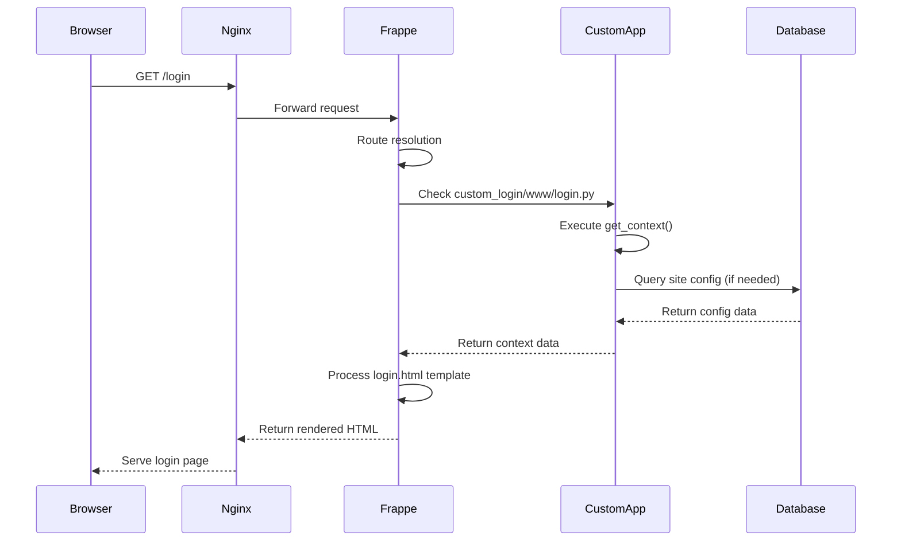
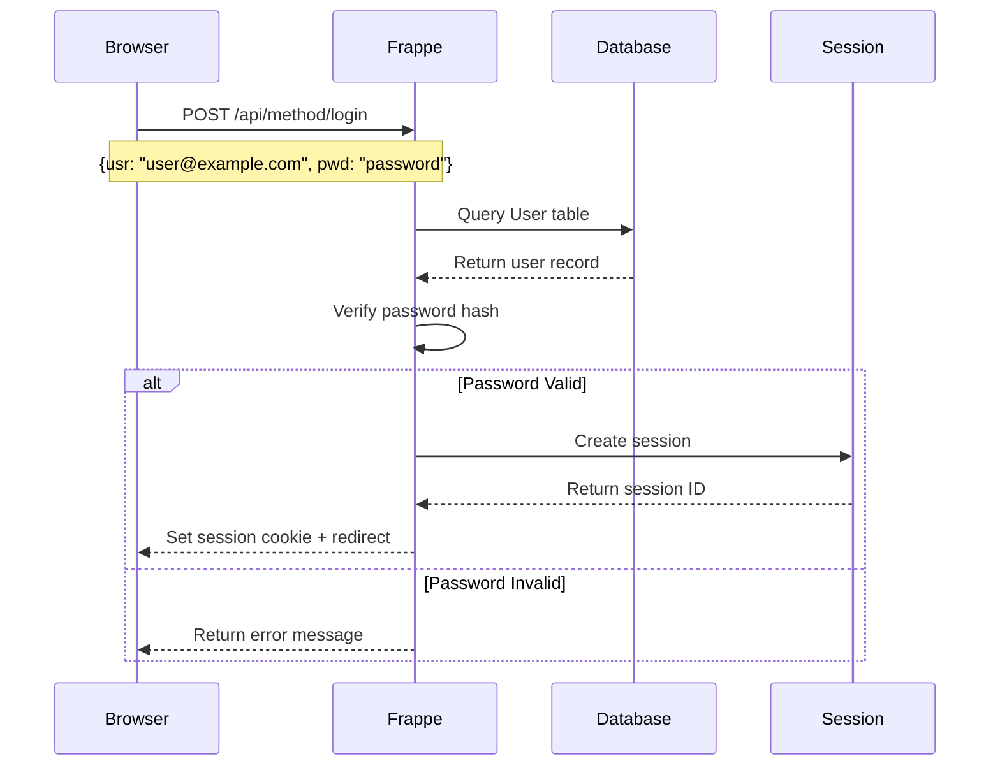
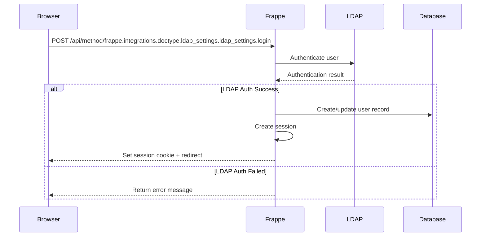

# Custom Login Technical Architecture & Communication Flow

## 📋 Table of Contents

- [Overview](#overview)
- [System Architecture](#system-architecture)
- [Communication Flow](#communication-flow)
- [Request-Response Cycle](#request-response-cycle)
- [Template Processing](#template-processing)
- [JavaScript Integration](#javascript-integration)
- [Authentication Flow](#authentication-flow)
- [Error Handling](#error-handling)
- [Performance Considerations](#performance-considerations)
- [Security Implementation](#security-implementation)

## 🎯 Overview

This document provides an in-depth technical analysis of how the custom login application integrates with Frappe's core system, detailing the communication patterns, data flow, and architectural decisions that enable seamless login page customization.

## 🏗️ System Architecture

### High-Level Architecture

```
┌─────────────────┐    ┌─────────────────┐    ┌─────────────────┐
│   Web Browser   │◄──►│  Nginx/Proxy    │◄──►│  Frappe Server  │
└─────────────────┘    └─────────────────┘    └─────────────────┘
                                                        │
                                                        ▼
                                               ┌─────────────────┐
                                               │  App Precedence │
                                               │     System      │
                                               └─────────────────┘
                                                        │
                                                        ▼
                                               ┌─────────────────┐
                                               │  Custom Login   │
                                               │      App        │
                                               └─────────────────┘
                                                        │
                                                        ▼
                                               ┌─────────────────┐
                                               │  Frappe Core    │
                                               │   (Fallback)    │
                                               └─────────────────┘
```

### Component Breakdown

#### 1. **Frappe App Precedence System**
```python
# Frappe's app loading order (apps.txt)
frappe
erpnext
custom_login  # ← Our custom app (loaded last, highest precedence)
```

#### 2. **Route Resolution Mechanism**
```python
# Route: /login
# Frappe checks in order:
1. custom_login/www/login.py + login.html
2. erpnext/www/login.py + login.html (if exists)
3. frappe/www/login.py + login.html (core fallback)
```

#### 3. **File Structure Mapping**
```
custom_login/
├── custom_login/
│   └── www/
│       ├── login.py          # Route handler (Python)
│       └── login.html        # Template (Jinja2)
└── hooks.py                  # App configuration
```

## 🔄 Communication Flow

### 1. Initial Request Flow



### 2. Template Processing Flow

```mermaid
graph TD
    A[HTTP Request /login] --> B[Frappe Route Handler]
    B --> C{Check App Precedence}
    C -->|Found| D[custom_login/www/login.py]
    C -->|Not Found| E[frappe/www/login.py]
    D --> F[Execute get_context()]
    F --> G[Set Custom Context Variables]
    G --> H[Load login.html Template]
    H --> I[Jinja2 Template Processing]
    I --> J[Include JavaScript Files]
    J --> K[Render Final HTML]
    K --> L[Return to Browser]
```

## 📡 Request-Response Cycle

### 1. **Initial Page Load**

#### Request Headers
```http
GET /login HTTP/1.1
Host: localhost:8000
User-Agent: Mozilla/5.0...
Accept: text/html,application/xhtml+xml,application/xml;q=0.9,*/*;q=0.8
Accept-Language: en-US,en;q=0.5
Accept-Encoding: gzip, deflate
Connection: keep-alive
```

#### Python Route Handler Processing
```python
# custom_login/custom_login/www/login.py
import frappe
from frappe import _

def get_context(context):
    """
    This function is called by Frappe's web framework
    when processing the /login route
    """
    # Step 1: Set custom title
    context["title"] = "Login into ERP PT ABC"
    
    # Step 2: Set meta description
    context["description"] = f"Login to {context['title']}"
    
    # Step 3: Add custom branding flag
    context["custom_branding"] = True
    
    # Step 4: Frappe automatically adds standard context:
    # - csrf_token
    # - site_name
    # - lang
    # - user info (if logged in)
    
    return context
```

#### Context Variables Available in Template
```python
{
    "title": "Login into ERP PT ABC",
    "description": "Login to Login into ERP PT ABC",
    "custom_branding": True,
    "csrf_token": "abc123...",
    "site_name": "development.localhost",
    "lang": "en",
    "user": "Guest",
    # ... other Frappe standard context variables
}
```

### 2. **Template Rendering Process**

#### Jinja2 Template Processing
```html
<!-- custom_login/custom_login/www/login.html -->


<!-- Step 1: Set page title -->
{{ title }}

<!-- Step 2: Add custom meta tags -->

<meta name="title" content="{{ title }}">
<meta name="description" content="{{ description }}">
<meta property="og:title" content="{{ title }}">
<meta name="twitter:title" content="{{ title }}">


<!-- Step 3: Render page content -->

<div class="login-wrapper">
    <div class="login-content page-card">
        <div class="page-card-head">
            <!-- This displays our custom title -->
            <h2 class="h4 text-muted">{{ title }}</h2>
        </div>
        <!-- Login form content -->
    </div>
</div>

```

#### Final HTML Output
```html
<!DOCTYPE html>
<html lang="en">
<head>
    <title>Login into ERP PT ABC</title>
    <meta name="title" content="Login into ERP PT ABC">
    <meta name="description" content="Login to Login into ERP PT ABC">
    <meta property="og:title" content="Login into ERP PT ABC">
    <!-- Frappe's standard CSS and JS includes -->
    <link rel="stylesheet" href="/assets/frappe/css/frappe-web.css">
    <script src="/assets/frappe/js/frappe-web.min.js"></script>
</head>
<body>
    <div class="login-wrapper">
        <div class="login-content page-card">
            <div class="page-card-head">
                <h2 class="h4 text-muted">Login into ERP PT ABC</h2>
            </div>
            <!-- Login form with CSRF token -->
            <form class="form-signin form-login hide" role="form">
                <input type="hidden" name="csrf_token" value="abc123...">
                <!-- Form fields -->
            </form>
        </div>
    </div>
    <!-- JavaScript includes -->
    <script>
        // Frappe's login.js functionality
        window.login = {};
        login.bind_events = function() { /* ... */ };
        // Custom login page JavaScript
        frappe.ready(function() {
            console.log("Custom login page loaded");
        });
    </script>
</body>
</html>
```

## 🎨 Template Processing

### 1. **Template Inheritance Chain**

```
custom_login/www/login.html
    ↓ extends
templates/web.html (Frappe core)
    ↓ extends  
templates/base.html (Frappe core)
```

### 2. **Block Override System**

```html
<!-- Base template defines blocks -->
<!-- templates/base.html -->
<html>
<head>
    <title>Default Title</title>
    
</head>
<body>
    
    
</body>
</html>

<!-- Our custom template overrides specific blocks -->
<!-- custom_login/www/login.html -->


{{ title }}  <!-- Override title -->
                     <!-- Override head includes -->
<meta name="title" content="{{ title }}">

                     <!-- Override page content -->
<h2>{{ title }}</h2>
<!-- Custom login form -->

```

### 3. **Jinja2 Variable Processing**

```python
# Context processing flow:
1. Frappe creates base context
2. get_context() adds custom variables
3. Jinja2 processes template with merged context
4. Variables are escaped for security
5. Final HTML is generated
```

## 🔧 JavaScript Integration

### 1. **JavaScript Loading Sequence**

```html
<!-- Loading order in final HTML -->
1. <script src="/assets/frappe/js/lib/jquery.min.js"></script>
2. <script src="/assets/frappe/js/frappe-web.min.js"></script>
3. <script></script>
4. <script>
   frappe.ready(function() {
       // Custom login page JavaScript
   });
   </script>
```

### 2. **Login.js Integration**

```javascript
// templates/includes/login/login.js (Frappe core)
window.login = {};

login.bind_events = function(email_field, password_field) {
    // Bind form submission events
    $('.btn-login').on('click', function(e) {
        e.preventDefault();
        login.call({
            cmd: 'login',
            usr: $('#' + email_field).val(),
            pwd: $('#' + password_field).val()
        });
    });
};

login.call = function(args) {
    // Make AJAX call to Frappe backend
    frappe.call({
        method: args.cmd,
        args: {
            usr: args.usr,
            pwd: args.pwd
        },
        callback: function(r) {
            if (r.message) {
                // Login successful - redirect
                window.location.href = '/desk';
            } else {
                // Show error message
                frappe.msgprint('Invalid credentials');
            }
        }
    });
};
```

### 3. **Custom JavaScript Integration**

```javascript
// Our custom JavaScript in login.html
frappe.ready(function() {
    // Initialize login functionality
    login.bind_events('login_email', 'login_password');
    
    // LDAP login functionality
    $('.btn-ldap-login').on('click', function(e) {
        e.preventDefault();
        var args = {
            cmd: "frappe.integrations.doctype.ldap_settings.ldap_settings.login",
            usr: $("#login_email").val(),
            pwd: $("#login_password").val()
        };
        login.call(args);
    });
});
```

## 🔐 Authentication Flow

### 1. **Standard Login Process**



### 2. **LDAP Authentication Flow**



### 3. **Session Management**

```python
# Session creation process
1. User submits credentials
2. Frappe validates credentials
3. Session record created in tabSessions
4. Session cookie set in browser
5. Subsequent requests include session cookie
6. Frappe validates session on each request
```

## ⚠️ Error Handling

### 1. **Client-Side Error Handling**

```javascript
// JavaScript error handling
login.call = function(args) {
    frappe.call({
        method: args.cmd,
        args: args,
        callback: function(r) {
            if (r.exc) {
                // Server exception occurred
                frappe.msgprint(r.exc);
            } else if (r.message) {
                // Success response
                window.location.href = r.message;
            } else {
                // Generic error
                frappe.msgprint('Login failed');
            }
        },
        error: function(xhr, status, error) {
            // Network or HTTP error
            frappe.msgprint('Network error: ' + error);
        }
    });
};
```

### 2. **Server-Side Error Handling**

```python
# Python error handling in login.py
def get_context(context):
    try:
        context["title"] = "Login into ERP PT ABC"
        context["description"] = f"Login to {context['title']}"
        
        # Additional processing...
        
    except Exception as e:
        # Log error
        frappe.log_error(f"Custom login error: {str(e)}")
        
        # Fallback to default values
        context["title"] = "Login"
        context["description"] = "Login to your account"
    
    return context
```

### 3. **Template Error Handling**

```html
<!-- Jinja2 error handling in template -->

<div class="login-wrapper">
    <div class="login-content page-card">
        <div class="page-card-head">
            <!-- Safe variable access with fallback -->
            <h2 class="h4 text-muted">{{ title or "Login" }}</h2>
        </div>
        
        
        <!-- Custom branding content -->
        
        <!-- Default content -->
        
    </div>
</div>

```

## ⚡ Performance Considerations

### 1. **Template Caching**

```python
# Frappe's template caching mechanism
1. Templates compiled to Python bytecode
2. Cached in memory for subsequent requests
3. Cache invalidated on file changes
4. bench clear-cache clears template cache
```

### 2. **Static Asset Optimization**

```html
<!-- Asset bundling and minification -->
<link rel="stylesheet" href="/assets/frappe/css/frappe-web.css?v=1234">
<script src="/assets/frappe/js/frappe-web.min.js?v=1234"></script>

<!-- Browser caching headers -->
Cache-Control: public, max-age=31536000
ETag: "abc123"
```

### 3. **Database Query Optimization**

```python
# Efficient context loading
def get_context(context):
    # Avoid unnecessary database queries
    # Use cached values where possible
    # Minimize context data size
    
    context["title"] = "Login into ERP PT ABC"  # Static value
    # Avoid: context["user_count"] = frappe.db.count("User")  # Expensive query
    
    return context
```

## 🔒 Security Implementation

### 1. **CSRF Protection**

```html
<!-- CSRF token automatically included -->
<form class="form-signin form-login" role="form">
    <input type="hidden" name="csrf_token" value="{{ csrf_token }}">
    <!-- Form fields -->
</form>
```

```javascript
// CSRF token included in AJAX requests
frappe.call({
    method: 'login',
    args: {
        usr: username,
        pwd: password
    },
    // CSRF token automatically added by frappe.js
});
```

### 2. **Input Sanitization**

```javascript
// XSS prevention in JavaScript
login.call = function(args) {
    args.usr = frappe.utils.xss_sanitise((args.usr || "").trim());
    // Password not sanitized (handled server-side)
    
    frappe.call({
        method: args.cmd,
        args: args
    });
};
```

```python
# Server-side input validation
@frappe.whitelist(allow_guest=True)
def login(usr, pwd):
    # Input validation
    if not usr or not pwd:
        frappe.throw("Username and password required")
    
    # Sanitize username
    usr = frappe.utils.cstr(usr).strip()
    
    # Authenticate user
    frappe.local.login_manager.authenticate(usr, pwd)
```

### 3. **Session Security**

```python
# Session configuration
{
    "session_expiry": "06:00",  # 6 hours
    "session_expiry_mobile": "720:00",  # 30 days for mobile
    "cookie_options": {
        "secure": True,      # HTTPS only
        "httponly": True,    # No JavaScript access
        "samesite": "Lax"    # CSRF protection
    }
}
```

## 🔍 Debugging and Monitoring

### 1. **Debug Mode Configuration**

```json
// site_config.json
{
    "developer_mode": 1,
    "debug": 1,
    "log_level": "DEBUG"
}
```

### 2. **Logging Implementation**

```python
# Custom logging in login.py
import frappe

def get_context(context):
    frappe.logger().info(f"Custom login page accessed by {frappe.session.user}")
    
    context["title"] = "Login into ERP PT ABC"
    
    frappe.logger().debug(f"Login context: {context}")
    
    return context
```

### 3. **Performance Monitoring**

```python
# Performance tracking
import time

def get_context(context):
    start_time = time.time()
    
    # Context processing
    context["title"] = "Login into ERP PT ABC"
    
    processing_time = time.time() - start_time
    frappe.logger().info(f"Login context processing took {processing_time:.3f}s")
    
    return context
```

## 📊 Communication Patterns

### 1. **Synchronous Communication**
- Initial page load (HTTP GET)
- Form submission (HTTP POST)
- Template rendering (Server-side)

### 2. **Asynchronous Communication**
- AJAX login requests
- Real-time validation
- Background session checks

### 3. **Event-Driven Communication**
- DOM ready events
- Form submission events
- Error handling events

---

This technical documentation provides a comprehensive understanding of how the custom login system integrates with Frappe's architecture, enabling developers to extend, modify, or troubleshoot the implementation effectively.